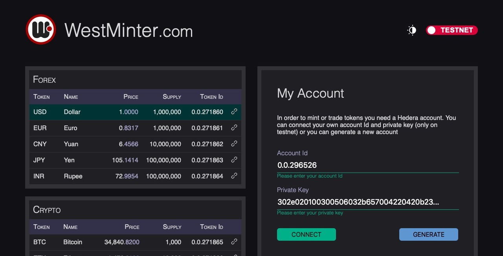
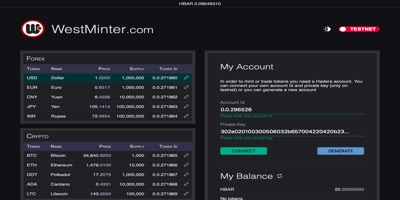

# WestMinter

## Token minter on Hedera Hashgraph

Create tokens for Crypto, Forex, Stocks, Commodities and much more

Visit us at [WestMinter.com/hedera](https://westminter.com/hedera)

## Mint your own tokens in Hedera Hashgraph

Easily create your own tokens in Hedera Hashgraph and start distributing them to your friends or business partners

Enter the name of your token, the symbol up to five chars, the total supply and the decimals, then hit the MINT button, your account Id will be used as admin and treasury for holding all tokens issued

It usually takes less than five seconds to mint your tokens. Once the transaction has been confirmed you can send your freshly minted tokens to other users on the Hedera Network, just copy the token Id provided after minting and use it in your transfer operations

In order to use any token not minted by you, it is necessary to press the link/unlink icon next to the token to associate/dissociate them with your account

By minting tokens you are accepting the fees corresponding to the transaction. You will have to enter your private key to complete the process. We do not store, transmit or use your private key except for the token generation process in this page

All transactions are executed on TESTNET

## Video

https://www.youtube.com/watch?v=UNTA2XtD8SU